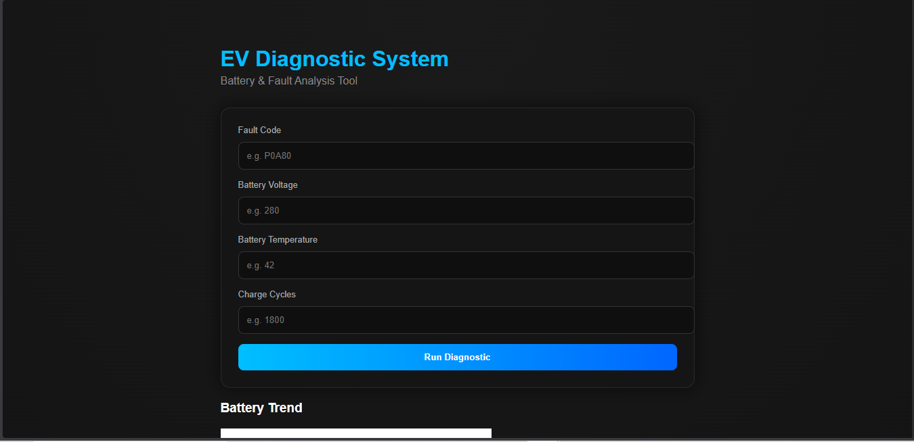
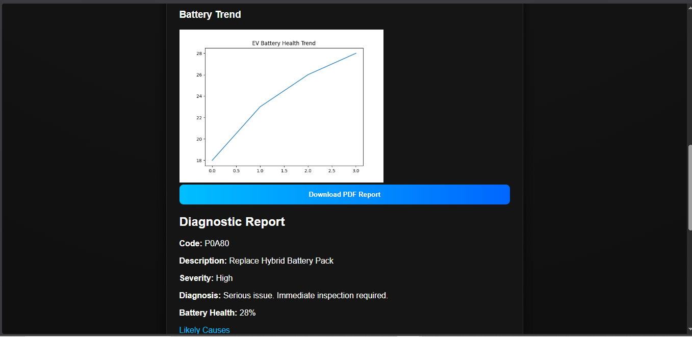
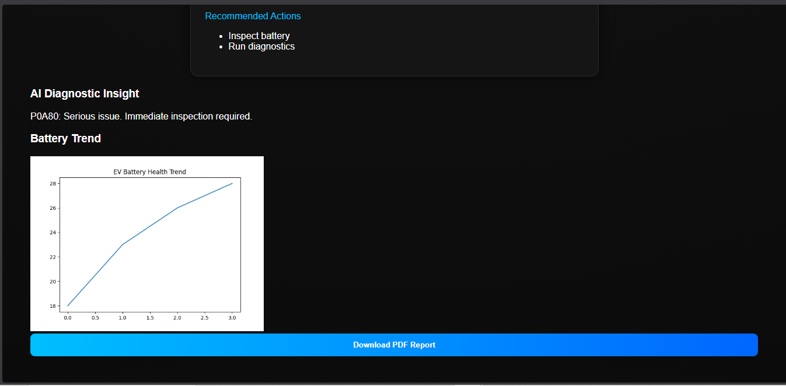

# EV Diagnostic App

---

# 🇪🇸 Versión en Español

## Descripción General

EV Diagnostic App es una aplicación web de diagnóstico para vehículos eléctricos desarrollada con Python y Flask.

El proyecto fue diseñado para simular flujos de diagnóstico OEM modernos inspirados en sistemas como BMW ISTA y Mercedes XENTRY.

Combina lógica de diagnóstico automotriz con desarrollo de software para demostrar conceptos avanzados de resolución de problemas EV, estimación de salud de batería e interpretación inteligente de fallos.

---

# Funciones Principales

## Interpretación de Códigos de Error

* Lectura de códigos de fallo EV desde una base CSV
* Visualización de descripciones de errores
* Información de diagnóstico
* Simulación de flujos de trabajo de taller

## Estimación de Salud de Batería

* Estimación basada en:

  * Voltaje
  * Temperatura
  * Ciclos de carga
* Cálculo del estado de salud de batería (SOH)

## Lógica Inteligente de Diagnóstico

* Clasificación de severidad:

  * Baja
  * Media
  * Alta
* Explicaciones estilo IA
* Análisis basado en reglas

## Interfaz Premium

* Dashboard oscuro inspirado en automoción
* Diseño tipo BMW / Mercedes
* Interfaz limpia y moderna

## Informes y Visualización

* Gráficos de salud de batería
* Generación de informes PDF
* Resultados estructurados

---

# Tecnologías Utilizadas

## Backend

* Python
* Flask
* Pandas

## Frontend

* HTML
* CSS
* Jinja2 Templates

## Datos y Visualización

* Matplotlib
* Base de datos CSV

## Generación PDF

* ReportLab

## Control de Versiones

* Git
* GitHub

---

# Objetivo Profesional

Este proyecto fue creado como:

* Proyecto profesional de portfolio
* Demostración de razonamiento de diagnóstico EV
* Unión entre automoción y software
* Preparación para puestos de técnico de diagnóstico EV

---

# 🇨🇦 Versió en Català

## Descripció General

EV Diagnostic App és una aplicació web de diagnòstic per a vehicles elèctrics desenvolupada amb Python i Flask.

El projecte està inspirat en fluxos de diagnòstic OEM moderns com BMW ISTA i Mercedes XENTRY.

Combina lògica de diagnòstic automobilístic amb desenvolupament de programari per demostrar conceptes avançats de diagnòstic EV, estimació de salut de bateria i interpretació intel·ligent d’errors.

---

# Funcions Principals

## Interpretació de Codis d’Error

* Lectura de codis EV des d’una base CSV
* Descripcions de fallades
* Informació de diagnòstic
* Simulació de fluxos de taller

## Estimació de Salut de Bateria

* Basada en:

  * Voltatge
  * Temperatura
  * Cicles de càrrega
* Càlcul de l’estat de salut (SOH)

## Lògica Intel·ligent de Diagnòstic

* Classificació de severitat:

  * Baixa
  * Mitjana
  * Alta
* Explicacions estil IA
* Anàlisi basada en regles

## Interfície Premium

* Dashboard fosc inspirat en automoció
* Estil BMW / Mercedes
* Interfície neta i moderna

## Informes i Visualització

* Gràfics de salut de bateria
* Generació d’informes PDF
* Resultats estructurats

---

# Tecnologies Utilitzades

## Backend

* Python
* Flask
* Pandas

## Frontend

* HTML
* CSS
* Plantilles Jinja2

## Dades i Visualització

* Matplotlib
* Base de dades CSV

## Generació PDF

* ReportLab

## Control de Versions

* Git
* GitHub

---

# Objectiu Professional

Aquest projecte ha estat creat com:

* Projecte professional de portfolio
* Demostració de pensament de diagnòstic EV
* Connexió entre automoció i programari
* Preparació per a rols de tècnic de diagnòstic EV

---

# English Version

## Overview

EV Diagnostic App is a web-based electric vehicle diagnostic assistant developed using Python and Flask.

The project was designed to simulate modern OEM diagnostic workflows inspired by systems such as BMW ISTA and Mercedes XENTRY.

It combines automotive diagnostic logic with software development to demonstrate advanced EV troubleshooting concepts, battery health estimation, and intelligent fault interpretation.

---

# Main Features

## Fault Code Interpretation

* Reads EV fault codes from CSV database
* Displays fault descriptions
* Provides diagnostic insights
* Simulates workshop diagnostic workflows

## Battery Health Estimation

* Estimates battery condition based on:

  * Voltage
  * Temperature
  * Charge cycles
* Calculates battery State of Health (SOH)

## Smart Diagnostic Logic

* Severity classification system:

  * Low
  * Medium
  * High
* AI-style diagnostic explanations
* Rule-based fault analysis

## Premium User Interface

* Dark automotive-inspired dashboard
* BMW / Mercedes workshop style design
* Clean diagnostic layout
* Responsive interface

## Reporting & Visualization

* Battery health visualization graph
* PDF diagnostic report generation
* Structured result summaries

---

# Technologies Used

## Backend

* Python
* Flask
* Pandas

## Frontend

* HTML
* CSS
* Jinja2 Templates

## Data & Visualization

* Matplotlib
* CSV-based diagnostic database

## PDF Generation

* ReportLab

## Version Control

* Git
* GitHub

---

# Project Structure

```bash
EV_DIAGNOSTIC_APP/
│
├── app.py
├── fault_codes.csv
├── templates/
│   └── index.html
├── static/
│   ├── style.css
│   ├── battery_graph.png
│   └── report.pdf
```

---

# Example Workflow

1. User enters:

   * Fault code
   * Voltage
   * Temperature
   * Charge cycles

2. Application processes:

   * Fault interpretation
   * Battery health analysis
   * Severity estimation
   * AI diagnostic explanation

3. System outputs:

   * Diagnostic result
   * Battery health percentage
   * Severity level
   * Recommendations
   * PDF report

---

# Future Improvements

## Planned Features

* Machine learning battery degradation prediction
* Real-time CAN bus integration
* OBD-II support
* Multi-vehicle database
* Workshop customer management
* Cloud diagnostics
* Remote reporting system

---

# Career Purpose

This project was created as:

* A professional portfolio project
* A demonstration of EV diagnostic thinking
* A bridge between automotive technology and software development
* Preparation for EV diagnostic technician roles

Target sectors include:

* Electric vehicle companies
* Premium dealerships
* Diagnostic workshops
* Battery analysis services

---

# Installation

## Clone Repository

```bash
git clone https://github.com/evdiagnostictech/ev-diagnostic-app.git
```

## Enter Project Folder

```bash
cd ev-diagnostic-app
```

## Install Dependencies

```bash
pip install flask pandas matplotlib reportlab
```

## Run Application

```bash
python app.py
```

---

# Screenshots

## Dashboard


## Diagnosis


## Graph


---

# Author

Developed by:

EV Diagnostic Technician Student & Software-Oriented Automotive Enthusiast

GitHub:
[https://github.com/evdiagnostictech](https://github.com/evdiagnostictech)
